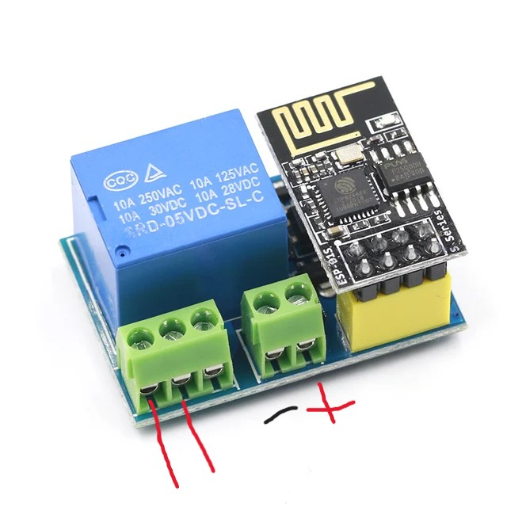

# What is it?
A reliable code that allows you to turn on relay from anywhere in the world using blynk. It is possible to integrate with the voice assistant using web hooks.
  
# How it work?
The relay receives a power-on request to esp-01.
The webhook should look like this: https://fra1.blynk.cloud/external/api/update?token=YOUR_API_TOKEN&V1=1

# Setup and installation
1. First, on the blynk.cloud website, you need to create a device, then get an api token and find the data streams item and create a v1-pin, data type:integer. Add an Image Button element to interact with the relay.
2. Edit the code by entering your API key, the ssid of your WiFi network, and its password. Flash it
3. Connect the board to the relay

4. Test this
